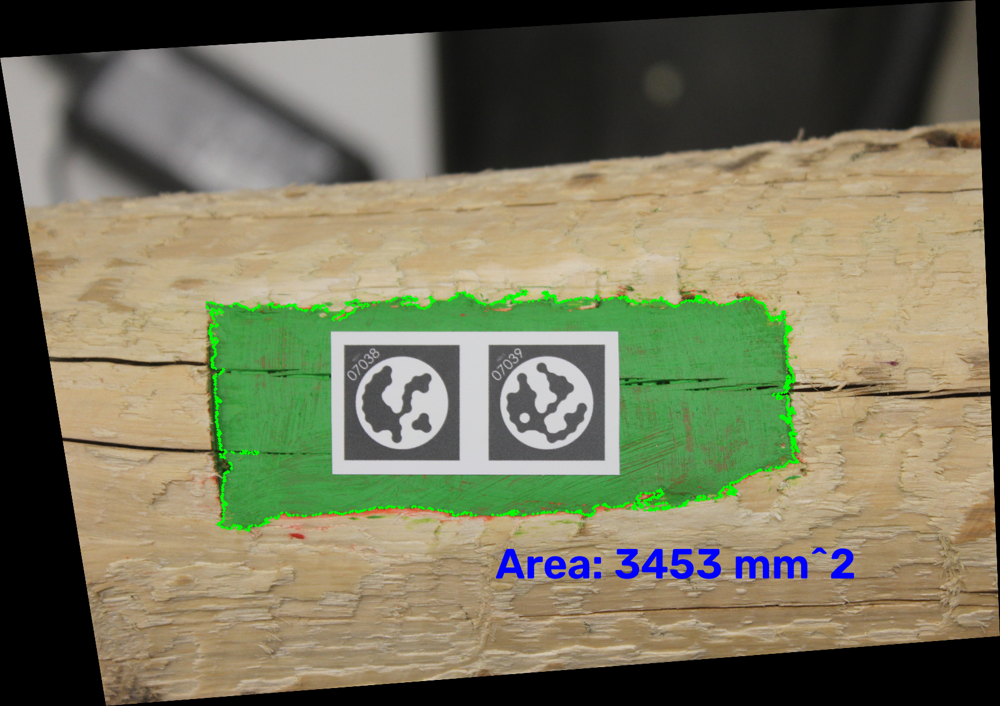
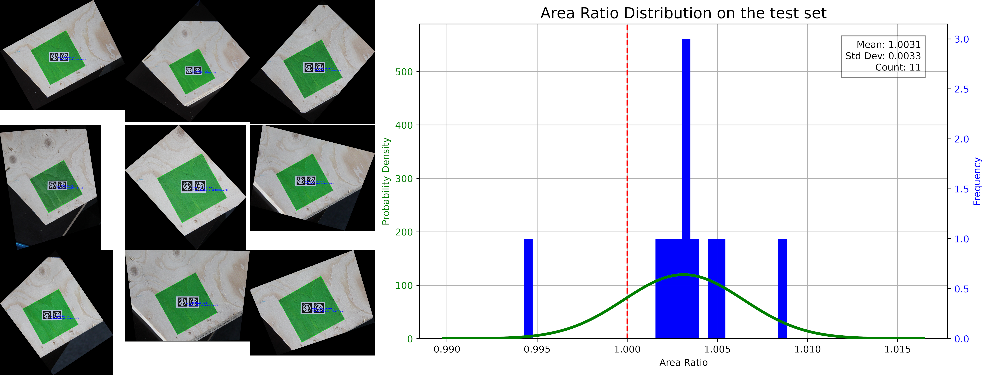

# mirometer
Mirometer is a tool that measures the area of a colored patch in a picture, using fiducial markers. 
In the case of IBOIS it is used to measure the area of joint faces made in irregular timber pieces.


# Usage
To use this code, we rely on [uv](https://docs.astral.sh/uv/getting-started/installation/), so you will need that installed.

With uv installed, run:
```bash
uv run main.py -i <path-of-image> -c (r,g,b)
# for example:
uv run main.py -i images/IMG_9106.JPG -c 65 160 65
```
You should have as result a .txt file in the same folder as the picture given, with the area of the patch in it, in mm2

to run the small evaluation with our data;
```bash
uv run evaluate.py -c 45 150 60 -a 10000
```
The result of the evaluation is represented hereunder, with 9 of the images and the resulting normal distribution



To evaluate with your own data, replace the images in `./evaluation_data` with your own images of a patch of known area and pass the known area using the `-a` parameter